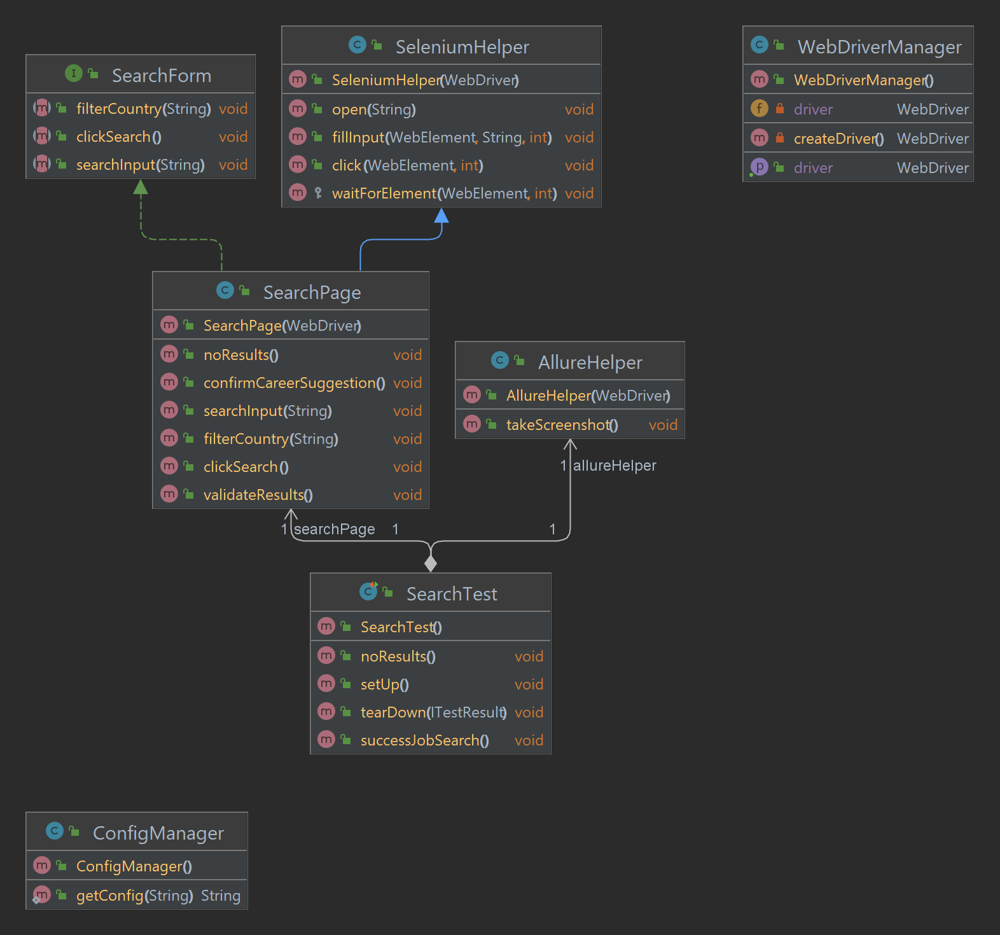

# Akamai tests
## Tools used

| Tool   | Link |
|--------|------|
| Maven  | https://maven.apache.org/download.cgi|
| Allure | https://docs.qameta.io/allure/|
| TestNG | https://testng.org/|
| jdk 11 | https://www.oracle.com/pl/java/technologies/javase/jdk11-archive-downloads.html|
| Selenium | https://selenium.dev|

## Run tests

To run the tests please download chromeDriver adn setup path to it in `src/main/resources/profiles/test/config.properties` file under `chromeDriverPath` variable.
Framework is designed to run tests only in Chrome, other browser can be added if needed.

```bash
mvn clean test -Ptest
```

## Generate report
```bash
allure serve allure-results
```

## Structure
